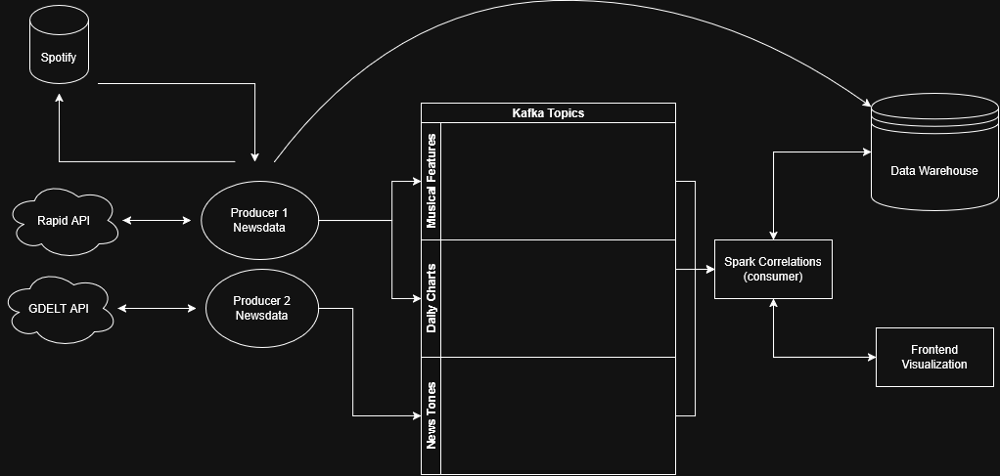

# Spotify Charts vs News Sentiment Analysis

Analyzing correlations between musical features of German Spotify Top 200 charts and news sentiment.

## Overview

This system investigates whether daily music listening patterns reflect the mood of news events in Germany (elections, major events, etc.).



## Architecture

**Kappa Architecture** using streaming data:

1. **Data Sources**

   - Spotify Top 200 charts (web scraping)
   - Musical features via RapidAPI (tempo, energy, danceability, valence, etc.)
   - News sentiment via GDELT API

2. **Kafka Topics**

   - `daily_charts` - Daily Spotify rankings
   - `musical_features` - Track audio characteristics
   - `news_tones` - Daily news sentiment scores

3. **Processing**

   - **Spark** consumes Kafka topics, joins by date, calculates correlations

4. **Storage**
   - **Supabase** stores raw data and correlation results

5. **Monitoring**
   - **Prometheus** collects metrics from Kafka and Spark
   - **Grafana** provides dashboards for pipeline observability

## Tech Stack

- **uv** - Python package management
- **Kafka** - Event streaming
- **Spark** - Stream processing
- **Supabase** - Data warehouse
- **Prometheus** - Metrics collection
- **Grafana** - Monitoring dashboards
- Python for producers/scrapers

## Getting Started

### Prerequisites

- Docker and Docker Compose
- Python 3.13+
- uv package manager

### Start Infrastructure

```bash
cd kafka-single-node
docker-compose up -d
```

This starts:
- Zookeeper (port 2181)
- Kafka (port 9092)
- Kafka UI (http://localhost:8081)
- Prometheus (http://localhost:9090)
- Grafana (http://localhost:3000)

### Access Monitoring

1. **Grafana**: http://localhost:3000
   - Username: `admin`
   - Password: `moodwave`

2. **Pre-configured Dashboards**:
   - **Kafka Overview**: Broker metrics, partition health, request rates
   - **MoodWave Pipeline**: Topic-specific metrics for `news_tones`, `daily_charts`, `musical_features`

3. **Prometheus**: http://localhost:9090
   - Query Kafka JMX metrics directly
   - Verify scrape targets at `/targets`

### Monitored Metrics

| Metric | Description |
|--------|-------------|
| `kafka_server_brokertopicmetrics_messagesinpersec_total` | Messages published per topic |
| `kafka_server_brokertopicmetrics_bytesinpersec_total` | Data throughput per topic |
| `kafka_controller_kafkacontroller_activecontrollercount` | Active controller health |
| `kafka_server_replicamanager_partitioncount` | Total partitions |
| `kafka_server_replicamanager_underreplicatedpartitions` | Replication issues |

## Project Status

Initial setup phase - core infrastructure and monitoring operational
