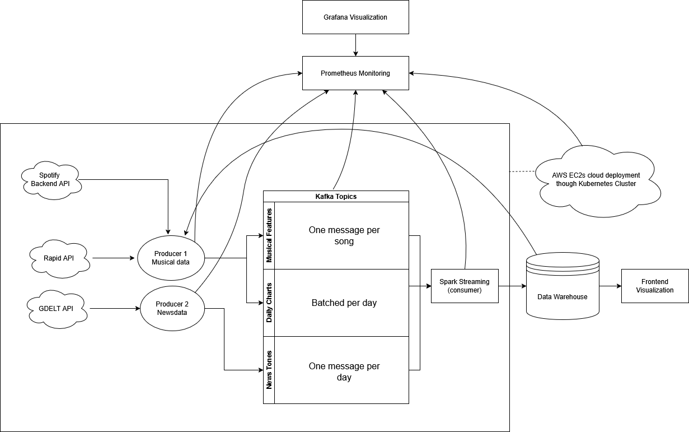
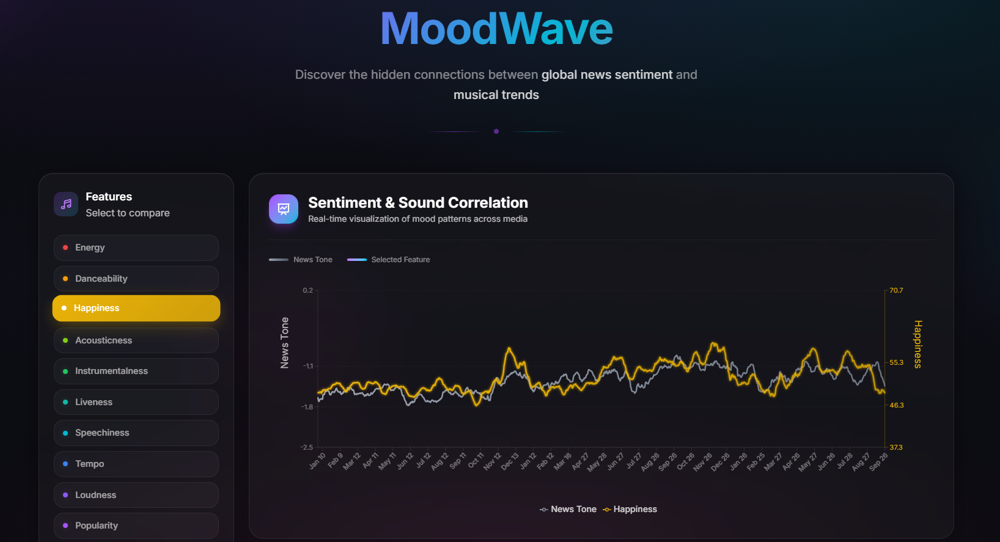

# MoodWave

**Analyzing correlations between German news sentiment and musical features in Spotify's daily Top 200 charts.**

Real-time data pipeline that ingests news tone data (GDELT) and Spotify chart data, processes them through Kafka and Spark, and visualizes correlations in a web dashboard.

## Architecture



**Data Flow:**

1. **Producers** → Fetch data and publish to Kafka topics
2. **Kafka** → Message broker (3 topics: news_tones, daily_charts, musical_features)
3. **Spark Consumer** → Dual-stream processing:
   - Stream 1: Raw data storage (append mode, immediate)
   - Stream 2: Daily aggregations with rank-based weighting (append mode with watermarks)
4. **Supabase** → PostgreSQL data warehouse
5. **Frontend** → Next.js visualization dashboard



## Tech Stack

- **Streaming:** Apache Kafka, Apache Spark (PySpark)
- **Storage:** Supabase (PostgreSQL)
- **Orchestration:** Kubernetes (k3s), Docker Compose
- **Monitoring:** Prometheus, Grafana
- **Frontend:** Next.js 15, React 19, Recharts, TypeScript
- **Data Sources:** GDELT API, Spotify Charts, RapidAPI (track features)

## Setup

### Prerequisites

- Python 3.13+ with `uv` package manager
- Docker & Docker Compose (for local) OR Kubernetes cluster (for production)
- Node.js 20+ (for frontend)
- API keys (see `.env.example`)

### 1. Environment Setup

```bash
# Clone and install dependencies
git clone <repo>
cd moodwave
cp .env.example .env
# Fill in your API keys in .env

# Install Python dependencies
uv sync
```

### 2. Local Development (Docker Compose)

```bash
# Start Kafka, Zookeeper, Kafka UI
cd docker
docker-compose up -d

# Start producers (MUST run before Spark consumer!)
uv run src/sandbox_producers/sandbox_news_producer.py &
uv run src/sandbox_producers/sandbox_track_producer.py &

# Wait ~30 seconds for messages to publish, then start Spark consumer
docker-compose up spark-consumer

# Start frontend
cd frontend
npm install
npm run dev  # http://localhost:3000
```

**⚠️ IMPORTANT:** Always start producers and let them publish messages **before** starting the Spark consumer. Otherwise Spark will fail.

### 3. Kubernetes Deployment

```bash
cd k8s

# 1. Create secrets (fill in your credentials)
kubectl apply -f secrets/moodwave-secrets.yaml

# 2. Deploy Kafka infrastructure
kubectl apply -f kafka/

# 3. Deploy producers (they'll start publishing immediately)
kubectl apply -f producers/

# 4. Wait ~60 seconds, then deploy Spark consumer
kubectl apply -f spark/

# 5. Optional: Deploy monitoring stack
kubectl apply -f monitoring/

# Check status
kubectl get pods
kubectl logs -f <pod-name>
```

**Access Points:**

- Kafka UI: `http://<node-ip>:30081`
- Prometheus: `http://<node-ip>:30090`
- Grafana: `http://<node-ip>:30300` (admin/moodwave2024)

### 4. Monitoring

Producers expose Prometheus metrics:

- News Producer: `:8000/metrics`
- Track Producer: `:8001/metrics`

Pre-built Grafana dashboards:

- Kafka Monitoring
- Spark Streaming Monitoring
- Kubernetes Cluster Overview

## Project Structure

```
moodwave/
├── src/
│   ├── producers/           # Real-time producers
│   ├── sandbox_producers/   # Simulation producers (accelerated time)
│   └── consumers/           # Spark streaming consumer
├── frontend/                # Next.js dashboard
├── docker/                  # Docker Compose setup
├── k8s/                     # Kubernetes manifests
│   ├── kafka/              # Kafka + Zookeeper + Kafka UI
│   ├── producers/          # Producer deployments
│   ├── spark/              # Spark consumer deployment
│   ├── monitoring/         # Prometheus + Grafana
│   ├── configmaps/         # Application config
│   └── secrets/            # Credentials (template)
├── monitoring/             # Prometheus/Grafana configs
├── config.yaml            # Application configuration
└── database_schemas.sql   # Supabase table schemas
```

## Key Features

- **Sandbox Mode:** Accelerated simulation using historical data (2020-01-01 onwards)
- **Weighted Aggregations:** Songs ranked higher and rising get more weight in daily averages
- **Late Data Handling:** 1-day watermark tolerates delayed messages
- **Reliability Scoring:** Tracks data completeness (% of chart with features)
- **Interactive Dashboard:** Select musical features, adjust smoothing, filter time ranges

## Configuration

Edit `config.yaml` to adjust:

- Kafka topics and brokers
- Producer intervals and date ranges
- Spark trigger intervals and checkpoints
- Sandbox simulation speed

## Database Schema

Tables in Supabase:

- `gdelt_daily_tone` - Daily news sentiment scores
- `spotify_regional_charts` - Raw chart positions
- `track_features` - Musical features per song
- `track_features_daily_avg` - Aggregated daily averages (weighted)

## Notes

- **Sandbox vs Production:** Sandbox producers use historical data for testing. Production producers fetch real-time data.
- **Spark Checkpoints:** Stored in `/tmp/spark_checkpoints` - persist this for production deployments.
- **API Limits:** Track producer simulates API delays and errors (~45% failure rate) to test resilience.

## License

MIT
